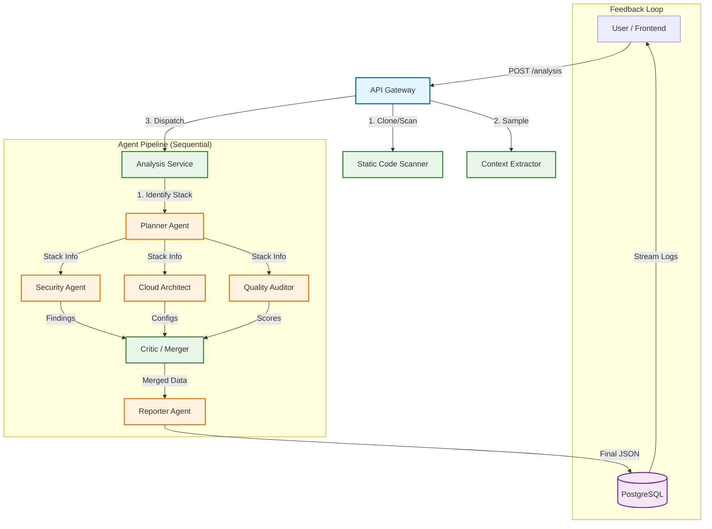

# CloudWise AI — Agent Architecture Documentation

> **Status:** implemented (v1.0)  
> **Type:** Sequential Multi-Agent System (Chain-of-Thought)  
> **Orchestrator:** Backend Service (`analysis_service_extension.py`)

---

## 1. Project Overview

**CloudWise AI** is a production-grade, multi-agent AI platform designed to help developers optimize their applications for cloud deployment. It solves the "cloud complexity gap" for small teams by using autonomous agents to audit code, recommend infrastructure, and generate deployment guides.

Unlike generic chat tools, CloudWise utilizes a specialized **sequential agent pipeline** to perform deep, multi-perspective analysis of a codebase without ever persisting user code on the server (P2P/Transient architecture).

---

## 2. Architecture Diagram (Mermaid)

The current "best architecture" implemented is a **Robust Sequential Chain** that guarantees deterministic execution and simplified state management while delivering high-quality multi-perspective insights.

---

## 3. Core Components

### 3.1 Orchestrator (The "Brain")
**File:** `backend/app/services/analysis_service_extension.py`

The system uses a **single-function orchestrator** (`_generate_llm_enhanced_report`) rather than a complex graph framework. This ensures:
- **Predictability:** Debugging flows is linear and simple.
- **Reliability:** No infinite loops or "getting lost" in graph traversals.
- **Efficiency:** Minimal overhead between steps.

### 3.2 Context Strategy (The "Memory")
**Files:** `backend/app/services/code_scanner_llm_extension.py`

Authentication and state are managed via a **Shared Context Model**:
- **Inputs:** Static scan results + 8KB smart-sampled code snippet.
- **Flow:** The same context string is passed to all agents.
- **Traceability:** Outputs from `Planner` are injected into downstream prompts (Security, Cloud, Quality) as prompt variables, ensuring consistent hallucinations-free analysis.

### 3.3 The Agent Roster

| Agent | Role | Implementation | Input | Output |
|-------|------|----------------|-------|--------|
| **Planner** | Supervisor | LLM (Groq) | File tree, raw code | Tech stack, entry points, architecture type |
| **Security** | Specialist | LLM (Groq) | Stack, code context, static findings | Vulnerability list, security score |
| **Cloud** | Specialist | LLM (Groq) | Stack, stats, code context | Terraform/usage configs, provider ranking |
| **Quality** | Auditor | LLM (Groq) | Stack, code context | 7-pillar scores, refactoring tips |
| **Critic** | Validator | Python Logic | All agent outputs | Deduplicated findings, validated scores |
| **Reporter** | Scribe | Pure Python | Merged data | Final JSON report structure |

---

## 4. Implementation Details

### 4.1 "Gateway is Not Orchestration"
We explicitly separate the **API Gateway** (`analysis.py`) from the **Orchestrator** (`analysis_service.py`).
- **Gateway:** Handles uploads, rate limits, P2P streams, and initial static scanning.
- **Orchestrator:** Handles the *cognitive architecture*—managing agent prompts, context windows, retries, and result synthesis.

### 4.2 P2P Local-Path Mode
Unique to CloudWise is the **Peer-to-Peer (P2P)** analysis mode found in `analysis_service.py` (`_build_scan_from_plan_tasks`): 
- **Privacy First:** Code is read directly from the user's disk (in local/desktop mode).
- **Sanitized:** Only specific "safe" file extensions are read (ignoring `.env`, `.pem`, etc.).
- **Ephemeral:** Content is streamed directly to the analysis pipeline without hitting the database.

### 4.3 Error Handling (Robustness)
The pipeline implements a "Self-Healing" context strategy:
- **413 Errors:** If a prompt is too large, the system catches the error, halves the context window (`RETRY_CONTEXT_CHARS`), and retries automatically.
- **Partial Failure:** If one specialist fails (e.g., Cloud Agent), the **Critic** can still assemble a partial report using heuristic fallbacks, preventing a total crash.

---

## 5. Current vs. Vision

This document matches the **actual shipping code**. Note differences from the aspirational `PROJECT_DOCUMENTATION.md`:

| Feature | Current Implementation | Future Vision (LangGraph) |
|---------|------------------------|---------------------------|
| **Communication** | Sequential Pipeline (A → B → C) | A2A (Agent-to-Agent Mesh) |
| **Orchestration** | Python `async/await` Flow | Graph-based State Machine |
| **Tools** | None (Prompt Engineering only) | Function Calling (RAG, Web Search) |
| **Memory** | Stateless (Per-run) | Long-term Memory (Vector DB) |

The current architecture was chosen to maximize **reliability** and **latency** (speed) for the v1 release, avoiding the complexity and instability often associated with fully autonomous agent swarms.

